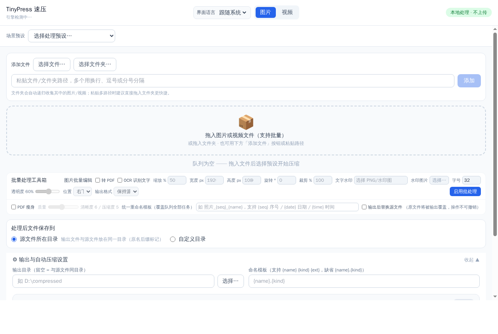
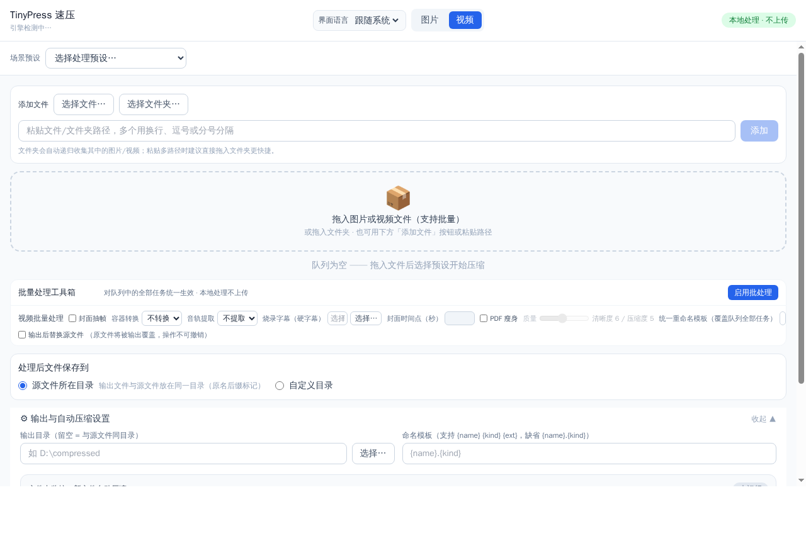

# TinyPress 速压

本地优先的 **图片 + 视频 批量压缩** 桌面工具，面向内容创作者与电商运营：

> 选平台预设 → 拖入文件 → 一键批量压缩出符合平台硬约束的文件。全程本地处理，不上传、无账号、免费开源。

## 功能总览

- **平台预设库（20+ 项）**：B站免二压 / 抖音竖屏 / 视频号 / 小红书 / 淘宝主图 / 拼多多 / 朋友圈(≤25MB) / YouTube / TikTok / 证件照 等，规则按平台公开约束核实，参数一键填充，也可自定义保存
- **图片批量压缩**：质量优先（mozjpeg / pngquant / libwebp / AVIF），支持目标体积二分逼近、缩放 / 宽高 / 旋转 / 居中裁剪 / 文字与图片水印 / 格式转换 / 批量重命名
- **图片转 PDF / PDF 瘦身**：图片合成 PDF（含透明通道）、扫描件逐页重压缩重建
- **OCR 文字识别**：批量提取图片中的文字（tesseract，中文/英文模型内置）
- **视频压缩**：x264 / x265 / SVT-AV1，NVENC / QSV / VideoToolbox 硬件加速自动适配并回退；支持目标体积压缩、限码率（B站免二压）、容器转换、音轨提取（MP3/WAV/M4A/FLAC/OGG）、封面抽帧、硬字幕压制、批量重命名
- **文件夹监控**：设置目录后自动压缩新增文件（带去重）
- **基础视频编辑**：截取起止、旋转、自动去黑边、居中裁剪（队列项级）
- **任务队列工程化**：进度事件、取消、失败重试、会话恢复、并发上限（默认 2）、完成后系统通知
- **多语言**：跟随系统 / 中文 / English
- **自动更新检测**：启动静默检查 GitHub 最新 Release，新版本横幅提示

## 界面预览





## 安装

从 [GitHub Releases](https://github.com/tinypress-dgl/tinypress/releases) 下载对应安装包：

| 平台 | 安装包 | 说明 |
|---|---|---|
| macOS | `TinyPress_*_universal.dmg` | Intel + Apple Silicon 通用 |
| Windows | `TinyPress_*_x64-setup.exe` | NSIS 安装包 |
| Linux | `TinyPress_*_amd64.deb` | Debian/Ubuntu |

> 引擎二进制（ffmpeg 等）随包内置，安装即用，无需额外配置。

## 隐私与安全

- **全程本地处理**：所有压缩在设备本机完成，文件不上传任何服务器
- 应用仅在启动时静默查询 GitHub 最新版本号（可关闭横幅），不收集任何使用数据
- 无账号、无遥测、无广告

## 开源与合规

- 代码：MIT License，全部原创
- 压缩引擎以**子进程**方式调用外部二进制（ffmpeg / mozjpeg / pngquant / libwebp / libavif / tesseract），不链接、规避 GPL 传染
- 随包分发已附各二进制许可证与源码可得性说明（`licenses/`），完整清单见 [`docs/COMPLIANCE.md`](docs/COMPLIANCE.md)

## 从源码构建

环境要求：Node.js ≥ 18、Rust 工具链、平台构建工具（Windows VS Build Tools / macOS Xcode CLT）。

```bash
npm install
node scripts/verify-env.mjs    # 一键环境自检
node scripts/fetch-bins.mjs    # 下载压缩引擎二进制
npm run tauri dev              # 开发模式
npm run tauri build            # 打包（NSIS / DMG / deb）
```

## 目录结构

```
tinypress/
├── src/            # React + TypeScript 前端（App / 队列 / 批处理面板 / i18n）
├── src-tauri/      # Rust 后端（Tauri v2）
│   └── src/
│       ├── commands.rs    # Tauri 命令入口
│       ├── engine/        # video / image / pdf / ocr / edit / audio / queue / watch
│       └── presets/       # 预设库（JSON 热更新设计）
├── scripts/        # 引擎下载 / 环境自检 / 许可证生成 / UI 端到端检查
├── docs/           # 产品方案 / 验证指南 / 合规清单 / 竞品分析 / 开发文档
├── landing/        # 产品落地页（中/英）
└── assets/         # 图标与界面截图
```

## 版本记录

| 版本 | 要点 |
|---|---|
| v0.6.4 | 批处理工具箱两行全宽排版；系统通知；自动更新横幅；关于对话框；总体进度条；clippy 全绿 |
| v0.6.3 | 无选中任务时右侧对比栏完全收起（浮层化） |
| v0.6.2 | 删左侧场景预设栏，预设移入中间栏；中间栏 7 段重排 |
| v0.6.0 | 多语言（跟随系统）；顶部 图片/视频 导航；预设管理器平台下拉；macOS 权限声明；音频能力保留 |
| v0.5.0 | 批量重命名模板；PDF 瘦身；硬/软字幕；智能压缩；OCR |
| v0.4.0 | 图片转 PDF；视频封面抽帧；批量替换源文件；格式扩展 |
| v0.3.0 | 图片批量编辑；视频容器转换；文件夹监控 |

开发细节、验证清单与历史 TODO 见 [`docs/README-DEV.md`](docs/README-DEV.md)。
